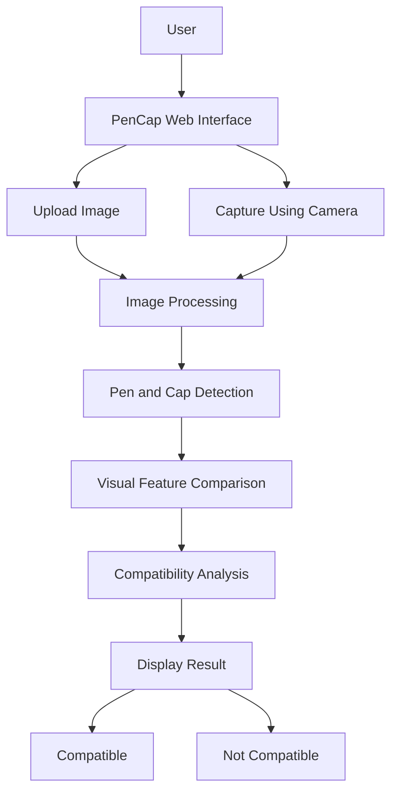

# pencap
Team Name:NzSH
Team members:
  Mohammed Nazim.M
  Sreehari.U

## Project Description

PenCap is a computer vision-based web application designed to determine whether a pen and its cap belong together. Users can upload an image or capture one using their camera. The system analyzes the pen and cap to provide a compatibility result.

## The Problem

People often lose pen caps or accidentally mix them with caps from other pens. It can be difficult to identify which cap belongs to which pen, especially when multiple pens and caps look similar.

There is no simple tool that allows users to check pen-cap compatibility using just an image.

## The Solution

PenCap provides a simple and interactive solution using computer vision.

Users can:
- Upload an image of a pen and cap.
- Capture an image using their camera.
- Allow the system to analyze the objects.
- Receive a compatibility result.

The system compares visual characteristics such as size, shape, and appearance to determine whether the pen and cap are likely to belong together.

## Technical Details

### Frontend
- HTML5
- CSS3
- JavaScript
- Responsive web design

### Computer Vision
- Image upload and camera capture
- Pen and cap detection
- Image processing
- Visual feature comparison
- Compatibility classification

### Working Process

1. The user uploads or captures an image.
2. The system identifies the pen and cap.
3. Visual features are extracted from the image.
4. The features of the pen and cap are compared.
5. The system displays the compatibility result.

### Output

The application provides a simple result:

✅ Compatible

or

❌ Not Compatible

## Future Scope

- AI-based pen and cap recognition
- Improved accuracy using machine learning
- Automatic size and shape measurement
- Support for multiple pen-cap combinations
- Compatibility confidence score
- Mobile application support
---
## Installation

### 1. Clone the Repository

```bash
git clone https://github.com/YOUR-USERNAME/PenCap.git
cd PenCap
## System Architecture


screenshots


## 🔮 Future Improvements

* 🤖 Machine-learning based compatibility detection
* 📏 More accurate size measurement
* 🧠 Advanced object detection
* 🎨 Improved color and shape comparison
* 📊 Compatibility confidence percentage
* 📱 Mobile optimization
* 🗃️ Pen model database
* 🔄 Support for multiple pens and caps
## 👨‍💻 Team

Built as a **beginner-friendly hackathon project** to explore computer vision and web development.


